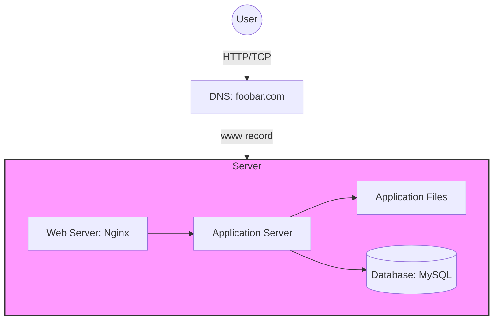

# Simple Web Stack

## Description

### Components
- **Server**: Physical or virtual machine running all components
- **Domain Name**: foobar.com (www record pointing to 8.8.8.8)
- **Web Server**: Nginx handling HTTP requests
- **Application Server**: Executes application logic
- **Application Files**: Website codebase
- **Database**: MySQL storing site data

### Communication Flow
1. User requests www.foobar.com
2. DNS resolves www.foobar.com to 8.8.8.8
3. Request reaches Nginx web server
4. Web server forwards to application server
5. App server processes request using codebase
6. Database queries as needed
7. Response sent back to user

### Infrastructure Issues

#### SPOF (Single Point of Failure)
- Single server hosts everything
- If any component fails, entire site goes down

#### Maintenance Downtime
- Code deployments require server restart
- No redundancy during updates

#### Scaling Limitations
- Single server can't handle high traffic
- No load distribution
- Resource constraints (CPU/RAM)
