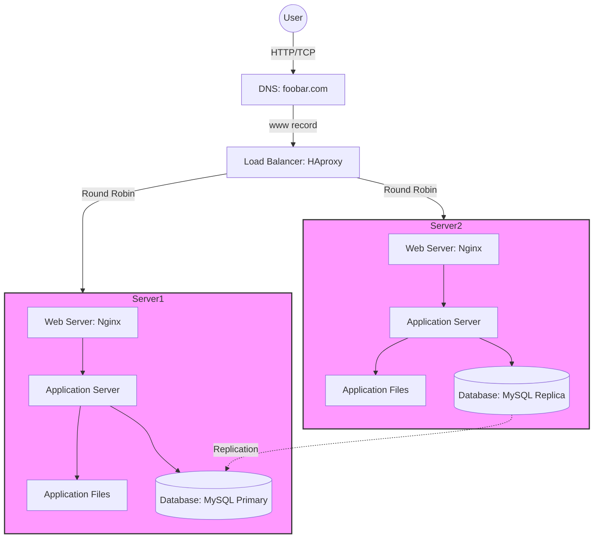

# Distributed Web Infrastructure

## Description

### Added Components
- **Load Balancer (HAproxy)**: Distributes incoming traffic
- **Server 2**: Additional server for redundancy
- **Database Primary-Replica**: MySQL replication setup

### Load Balancer Configuration
- **Algorithm**: Round Robin
- **Setup**: Active-Active
  - Both servers actively handle requests
  - Traffic distributed evenly
  - Better resource utilization than Active-Passive

### Database Primary-Replica
- **Primary Node**: Handles writes
- **Replica Node**: Handles reads
- **Replication**: Async from Primary to Replica
- **Application Impact**: Read queries can be distributed

### Infrastructure Issues

#### SPOF
- Load balancer is single point of failure
- Primary MySQL database

#### Security Issues
- No firewall protection
- No HTTPS encryption
- Unsecured traffic

#### Monitoring
- No monitoring system
- Unable to track:
  - Server health
  - Application performance
  - Database status
  - Traffic patterns
