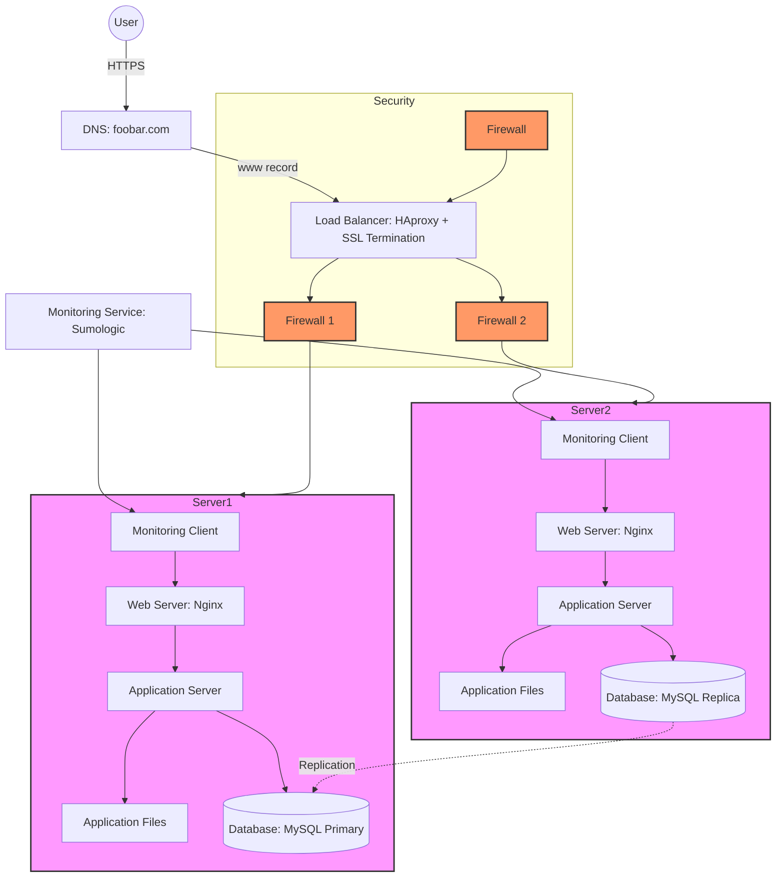

# Secured and Monitored Web Infrastructure

## Description

### Added Security Components
- **3 Firewalls**: Protection layers for load balancer and servers
- **SSL Certificate**: HTTPS encryption for www.foobar.com
- **3 Monitoring Clients**: Data collectors for infrastructure monitoring

### Security Measures
- **Firewalls**: Filter and control traffic
- **HTTPS**: Encrypted data transmission
- **SSL Termination**: At load balancer level

### Monitoring Setup
- **Service**: Sumologic (or similar)
- **Data Collection**:
  - System metrics (CPU, memory, disk)
  - Application logs
  - Network traffic
  - Security events
- **QPS Monitoring**: Track queries per second via web server logs

### Infrastructure Issues

#### SSL Termination at Load Balancer
- Decrypted traffic between load balancer and servers
- Internal network vulnerability

#### Single Write Database
- No write redundancy
- Potential data loss on primary failure

#### Uniformity Risk
- All servers have identical components
- No component-specific optimization
- Resource competition between services
