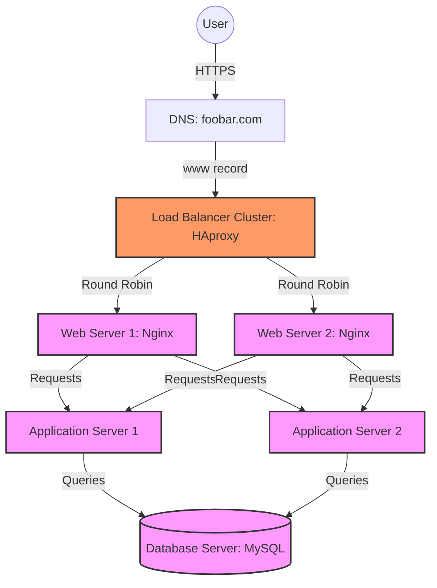

# Scale Up Infrastructure

## Description

### Component Split
- **Web Servers**: Dedicated Nginx servers for static content
- **Application Servers**: Separate servers for business logic
- **Database Server**: Standalone server for data management
- **Load Balancer Cluster**: HAproxy in high availability

### Benefits
- **Specialized Optimization**: Each component can be tuned for its specific role
- **Independent Scaling**: Components can scale based on their specific needs
- **Resource Isolation**: No competition between different services
- **Maintenance Flexibility**: Components can be maintained independently
- **Better Monitoring**: Clearer metrics per component

### Additional Elements
- **Load Balancer Cluster**: Eliminates load balancer as single point of failure
- **Separated Components**: Each major function has dedicated resources
